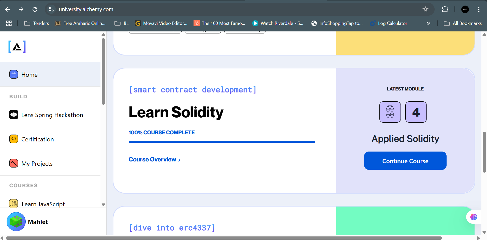

## Learn Solidity with Alchemy

A snapshot of our journey through [Alchemy’s Learn Solidity course](https://www.alchemy.com/university/courses/solidity). This repo covers four modules, from basics to applied patterns, showing our hands-on work building smart contracts on Ethereum.

---

### Course at a Glance
- **Provider:** Alchemy
- **Duration:** Four modules, each with practical exercises
- **Goal:** Understand Solidity syntax, data handling, contract interactions, and real-world dApp patterns

---

### Modules Overview
1. **Introduction to Solidity**  
   Setup, basic syntax, state variables, functions, and simple storage contract.
2. **Address Interactions**  
   Working with `address` type: sending/receiving Ether, calling other contracts, security checks.
3. **Reference Types**  
   Arrays, structs, mappings, strings, memory vs. storage, and gas-efficient patterns.
4. **Applied Solidity**  
   Build a voting system, use inheritance for reusable access control, and combine concepts in mini dApps.

---

## Screenshot

---

